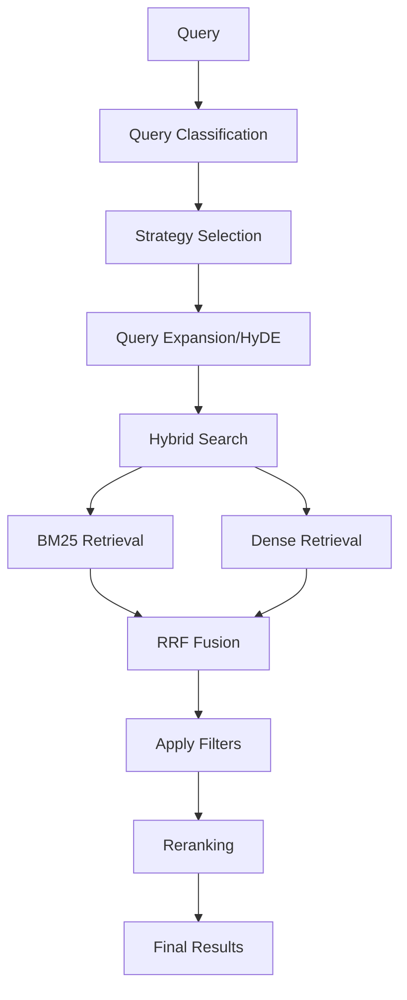

# Vyasa Intelligence

A production-grade RAG (Retrieval-Augmented Generation) system for querying the Mahabharata, one of the greatest epics of ancient India.

## Overview

Vyasa Intelligence provides intelligent answers to questions about the Mahabharata using:
- **Hybrid Retrieval**: Combines BM25 (keyword) and dense (semantic) search with Reciprocal Rank Fusion
- **Mahabharata-aware Chunking**: Hierarchical chunking by Parva/Adhyaya for better context preservation
- **Local-first Development**: Built with Ollama for local development, Groq for production
- **Production-ready**: Containerized with Docker, Kubernetes-ready, CI/CD pipeline
- **Quality Gates**: Ragas evaluation with faithfulness ≥ 0.85, answer relevancy ≥ 0.80

## Architecture

### Retrieval Pipeline (M2)

The retrieval pipeline implements a sophisticated hybrid search system with the following components:

#### 1. Query Classification
- **Types**: Entity, Philosophical, Narrative, Conceptual, Temporal, Comparative
- **Method**: Combines pattern matching, keyword analysis, and semantic similarity
- **Purpose**: Determines optimal retrieval strategy for each query type

#### 2. Hybrid Search
- **BM25 Retrieval**: Keyword-based search with tokenization
- **Dense Retrieval**: Semantic search using BGE-base-en embeddings
- **Reciprocal Rank Fusion (RRF)**: Merges results with configurable weights

#### 3. Advanced Features
- **Query Expansion**: Adds Mahabharata-specific synonyms
- **HyDE**: Generates hypothetical documents for better semantic matching
- **Diversity Reranking**: Ensures result diversity
- **Contextual Retrieval**: Uses conversation history for better results

#### 4. Reranking
- **Cross-Encoder**: BGE-reranker-base for precise relevance scoring
- **Multi-stage**: Coarse-to-fine reranking pipeline
- **Fallback**: Keyword-based reranking when models unavailable

### Flow Diagram



## Technology Stack

- **Backend**: Python 3.11+ with FastAPI
- **LLM**: Ollama (local) → Groq (production)
- **Vector Database**: ChromaDB
- **Search**: BM25 + Dense embeddings with BGE base model
- **Frontend**: Gradio for demos
- **Testing**: pytest + Ragas evaluation
- **Containerization**: Docker with multi-stage builds
- **Orchestration**: Kubernetes (Rancher Desktop for local)

## Quick Start

### Prerequisites

- Python 3.11 (use pyenv for version management)
- Docker and Docker Compose
- Ollama (for local LLM)
- Rancher Desktop (for local Kubernetes)

### Installation

1. **Clone the repository**
   ```bash
   git clone https://github.com/nilesh0604/vyasa-intelligence.git
   cd vyasa-intelligence
   ```

2. **Set up Python environment**
   ```bash
   # Install Python 3.11 using pyenv
   pyenv install 3.11.9
   pyenv local 3.11.9
   
   # Create virtual environment
   python -m venv venv
   source venv/bin/activate  # On Windows: venv\Scripts\activate
   
   # Install dependencies
   pip install -e .
   ```

3. **Install Ollama and pull model**
   ```bash
   # macOS
   brew install ollama
   
   # Start Ollama service
   ollama serve &
   
   # Pull model (2B for speed, 8B for quality)
   ollama pull llama3.2
   ```

4. **Configure environment**
   ```bash
   cp .env.example .env
   # Edit .env with your API keys
   ```

5. **Run the API**
   ```bash
   uvicorn src.api.main:app --reload --host 0.0.0.0 --port 8000
   ```

6. **Access the API**
   - API Documentation: http://localhost:8000/docs
   - Health Check: http://localhost:8000/health

## Development Workflow

### Phase 0: Environment Setup
- [x] Python 3.11 with pyenv
- [x] Install dependencies
- [ ] Ollama with llama3.2 model
- [ ] Environment variables
- [ ] Pre-commit hooks

### Phase 1: Corpus Ingestion
- [ ] Download Mahabharata corpus
- [ ] Implement document loader
- [ ] Create Mahabharata-aware chunker
- [ ] Build ChromaDB and BM25 indices

### Phase 2: Retrieval Pipeline ✅
- [x] Query classification with Mahabharata-aware types
- [x] Hybrid search (BM25 + dense) with RRF fusion
- [x] Cross-encoder reranking
- [x] Adaptive retrieval strategies
- [x] Diversity-aware reranking
- [x] Contextual retrieval with conversation history

### Phase 3: Generation
- [ ] Prompt templates with citations
- [ ] LLM abstraction layer
- [ ] Guardrails and content safety
- [ ] Response caching

### Phase 4: Evaluation
- [ ] Golden dataset creation
- [ ] Ragas evaluation
- [ ] Quality gates
- [ ] Performance benchmarks

## Project Structure

```
vyasa-intelligence/
├── src/
│   ├── api/              # FastAPI application
│   ├── evaluation/       # Ragas evaluation
│   ├── generation/       # LLM generation
│   ├── ingestion/        # Document processing
│   ├── llm/             # LLM factory abstraction
│   └── retrieval/       # Search and retrieval
├── data/
│   ├── raw/             # Original documents
│   ├── processed/       # Processed chunks
│   └── chroma/          # Vector database
├── tests/
│   ├── unit/            # Unit tests
│   └── integration/     # Integration tests
├── k8s/                 # Kubernetes manifests
├── .github/workflows/   # CI/CD pipelines
├── pyproject.toml       # Project configuration
├── .env.example         # Environment variables template
└── README.md
```

## API Usage

### Query Endpoint

```bash
curl -X POST "http://localhost:8000/query" \
  -H "Content-Type: application/json" \
  -d '{
    "question": "What is the dharma dilemma faced by Arjuna?",
    "user_role": "public",
    "top_k": 5
  }'
```

Response format:
```json
{
  "answer": "Arjuna faces a profound dharma dilemma...",
  "sources": [
    "Bhishma Parva, Chapter 25",
    "Bhishma Parva, Chapter 26"
  ],
  "retrieval_time_ms": 245.5,
  "generation_time_ms": 1250.3
}
```

## Docker Deployment

```bash
# Build and run with Docker Compose
docker compose up --build

# Access services
# API: http://localhost:8000
# Gradio UI: http://localhost:7860
# Redis: localhost:6379
```

## Kubernetes Deployment ✅

The application is fully Kubernetes-ready and has been successfully deployed to Rancher Desktop with all production features:

```bash
# One-command deployment
./deploy-k8s.sh

# Or manual deployment
kubectl apply -f k8s/
kubectl create secret generic vyasa-secrets --from-env-file=.env -n vyasa

# Check deployment status
kubectl get pods -n vyasa
kubectl get hpa -n vyasa
kubectl get ingress -n vyasa
```

### Deployment Features
- **Auto-scaling**: HPA configured (2-5 replicas) based on CPU/memory
- **Health Monitoring**: Readiness and liveness probes
- **Load Balancing**: Ingress accessible at http://vyasa.local
- **Resource Management**: Proper CPU/memory limits
- **Zero-downtime**: Rolling updates and restarts

### Access Methods
```bash
# Via Ingress (add to /etc/hosts: 127.0.0.1 vyasa.local)
curl http://vyasa.local/health

# Via port-forward
kubectl port-forward svc/vyasa-api-service 8000:80 -n vyasa
curl http://localhost:8000/health
```

## CI/CD Pipeline

The project implements a comprehensive 4-gate CI/CD pipeline using GitHub Actions:

### Pipeline Gates

1. **Gate 1: Code Quality & Linting**
   - Black code formatting
   - isort import sorting
   - Ruff linting
   - MyPy type checking
   - Bandit security linting

2. **Gate 2: Unit Tests**
   - pytest with coverage reporting
   - Upload coverage to Codecov
   - Minimum 80% coverage requirement

3. **Gate 3: Integration Tests**
   - API endpoint testing
   - Database integration
   - Redis connectivity
   - Service health checks

4. **Gate 4: Quality Gates Evaluation**
   - Ragas evaluation metrics
   - Faithfulness ≥ 0.85
   - Answer relevancy ≥ 0.80
   - Overall score ≥ 80%

### Workflows

- **CI/CD Pipeline** (`.github/workflows/ci-cd.yml`): Main pipeline with 4 gates
- **Security Scan** (`.github/workflows/security.yml`): Comprehensive security scanning
- **Dependency Update** (`.github/workflows/dependency-update.yml`): Automated dependency updates
- **Release** (`.github/workflows/release.yml`): Automated releases with Helm chart

### Required Secrets

Add these secrets to your GitHub repository:

```bash
# Docker Hub (for container registry)
DOCKER_USERNAME=your_docker_username
DOCKER_PASSWORD=your_docker_token

# Optional: Snyk for dependency scanning
SNYK_TOKEN=your_snyk_token

# Optional: Gitleaks license
GITLEAKS_LICENSE=your_gitleaks_license
```

### Local Scripts

- `scripts/quality-gates.sh`: Run quality gates locally
- `scripts/deploy-k8s.sh`: Deploy to Kubernetes
- `scripts/smoke-test.sh`: Run smoke tests against deployed service

## Quality Gates

The project maintains strict quality standards:
- **Faithfulness**: ≥ 0.85 (answer grounded in context)
- **Answer Relevancy**: ≥ 0.80 (relevant to question)
- **Security**: No HIGH severity issues
- **Performance**: P95 latency < 3s

Run evaluation:
```bash
python -m src.evaluation.ragas_eval \
  --dataset data/golden_dataset.jsonl \
  --output reports/ragas_eval.json
```

Run quality gates locally:
```bash
./scripts/quality-gates.sh
```

## Contributing

1. Fork the repository
2. Create a feature branch (`git checkout -b feature/amazing-feature`)
3. Commit your changes (`git commit -m 'feat: add amazing feature'`)
4. Push to the branch (`git push origin feature/amazing-feature`)
5. Open a Pull Request

### Code Standards

- Follow PEP 8 for Python code
- Use Black for formatting
- Add type hints to all functions
- Write comprehensive docstrings
- Include unit tests for new features

## License

This project is licensed under the MIT License - see the LICENSE file for details.

## Acknowledgments

- The Mahabharata translation by K.M. Ganguli
- The open-source RAG community
- LangChain for the LLM framework
- ChromaDB for vector storage